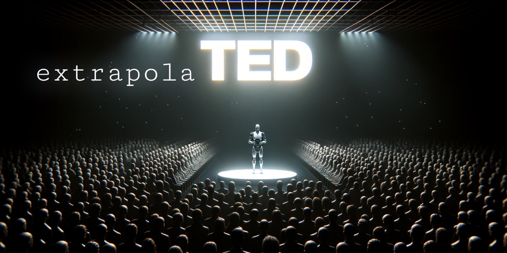

# extrapolaTED: Unveiling the Unspoken

[](https://app.wordware.ai/r/25184ff7-db28-4c50-a0c4-2addbf31c28f)

> __Elevating knowledge sharing through Generative AI. Dive into the realms of the untouched and the unspoken, with extrapolaTED.__

extrapolaTED is a pioneering application designed to craft TED-like lectures on any conceivable topic. Through a fusion of AI and human genius, we're pushing the boundaries of education and information dissemination. Our mission is to democratize knowledge, making the unknown known to all.

## :rocket: Features

- **Boundless Exploration**: Venture into any subject with TED-like insights powered by Generative AI.
- **Holistic Understanding**: Utilize a rich tapestry of resources including Wikipedia, Arxiv abstracts, and more for a well-rounded grasp of topics.
- **Creative Generation**: Witness the blend of ChatGPT and Dall-E 3 in producing captivating content and visuals.
- **Voice Synthesis**: Experience smooth, natural narrations courtesy of [ElevenLabs](https://elevenlabs.io) API.
- **Multi-step API Calls**: Harness the power of [Wordware](https://wordware.ai) for efficient API orchestration.

## :bulb: Methodology

### Data

Dive deep into the heart of extrapolaTED with a wide array of datasets that serve as the bedrock of our content generation:

- **TED Dataset**: With over __1,000 transcripts__, this dataset provides a profound understanding of the topics already covered in TED talks, aiding in the exploration of new territories.
- **Arxiv Abstracts (`unum-cloud/ann-arxiv-2m`)**: A treasure trove of __2 million vectorized abstracts__ summarizing the latest strides in scientific research.
- **WIT - Wikipedia Images Dataset**: A rich collection of well over __3 million images__ aiding in the visual representation of generated content.
- **Wikipedia Abstracts (`wikipedia`)**: The __6 million abstracts__ in this dataset serve as a solid foundation for textual content, providing ground-truth retrieval of factual information.

### Technology

Embark on a technological odyssey encompassing retrieval, embedding, story and image generation:

- **[USearch](https://github.com/unum-cloud/usearch)** is our go-to technology for efficient and precise retrieval of relevant data from our expansive datasets.
- **[UForm](https://github.com/unum-cloud/uform)** takes charge of image embeddings, making visual content more accessible and meaningful.
- **[Wordware](https://wordware.ai)** facilitates multi-step API calls, streamlining the integration of different technologies into a cohesive workflow.
- **ChatGPT**: A cornerstone in our story generation pipeline, ChatGPT transforms raw data into engaging narratives, bringing topics to life.
- **Dall-E 3**: When it comes to image generation, Dall-E 3 steps in to create captivating visuals that resonate with the generated content.
- **ElevenLabs API**: Leveraged for voice synthesis, ElevenLabs breathes life into our content, making the learning experience more immersive.

## :hammer_and_wrench: Setup

Get started with extrapolaTED in a breeze:

1. **Environment Setup**:
   - Using Anaconda:
     ```sh
     conda env create -f conda.yml
     conda activate extrapolaTED
     ```
   - Or manually with PIP:
     ```sh
     conda create -n extrapolated python=3.10
     pip3 install torch torchvision torchaudio --index-url https://download.pytorch.org/whl/cu118
     pip3 install -r requirements.txt
     ```

2. **Data Preparation**:
   - Execute the following scripts to download and prepare the necessary data:
     ```sh
     ./download_arxiv_texts.sh
     ./download_wiki_images.sh
     python prepare_arxiv_texts.ipynb
     python prepare_ted_texts.ipynb
     python prepare_wiki_images.py
     python prepare_wiki_texts.ipynb
     ```

3. **Server Startup**:
   - Launch the server to power retrieval augmentation:
     ```sh
     python server.py
     ```

4. **Exploration**:
   - Open your Jupyter Notebook and start generating TED-like lectures on your desired topics.
   - Or simply open the [Wordware Prompt Pipeline](https://app.wordware.ai/r/25184ff7-db28-4c50-a0c4-2addbf31c28f) and start playing with it!

Your journey towards creating insightful and illuminating TED-like lectures begins now!

## :star2: The Minds Behind

- **[Ash Vardanian](https://github.com/ashvardanian)**: The architect behind USearch, UForm, and the retrieval pipelines.
- **[Tyler Neylon](https://github.com/tylerneylon)**: The person behind [Explacy](https://github.com/tylerneylon/explacy) and maestro of prompting and video generation.
- **[Robert Chandler](https://github.com/nyacg)**: The visionary behind Wordware, the platform that empowers Language model apps.

## :file_folder: Project Structure

Navigate through the well-organized directory structure to explore the different facets of extrapolaTED:

```plaintext
├── README.md
├── requirements.txt
├── conda.yml
├── mount_disks.sh
├── download_arxiv_texts.sh
├── download_wiki_images.py
├── download_wiki_images.sh
├── prepare_embeddings.py
├── prepare_arxiv_texts.ipynb
├── prepare_ted_texts.ipynb
├── prepare_wiki_images.py
├── prepare_wiki_texts.ipynb
├── server.py
├── data
│   ├── ann-arxiv-2m
│   │   ├── abstract.e5-base-v2.fbin
│   │   ├── abstract.e5-base-v2.usearch
│   │   ├── title_abstract.parquet
│   │   └── title_abstract.tsv
│   ├── ann-wiki-6m
│   │   ├── abstract.e5-base-v2.fbin
│   │   ├── abstract.e5-base-v2.usearch
│   │   ├── downloads
│   │   ├── title_abstract.parquet
│   │   └── wikipedia
│   └── ann-wiki-images-3m
│       ├── abstract.e5-base-v2.fbin
│       ├── abstract.e5-base-v2.usearch
│       ├── abstract.uform-vl-english.fbin
│       ├── images.uform-vl-english.fbin
│       └── title_abstract.parquet
├── article_generation
│   ├── add_images_to_transcript.ipynb
│   ├── betterfy_prompt.txt
│   ├── example_input_1_french_architecture.json
│   ├── example_transcript_1_french_architecture.json
│   ├── learn_to_generate_articles.ipynb
│   ├── learn_to_generate_images.ipynb
│   └── raw_articles
│       ├── architecture_of_paris.txt
│       ├── french_architecture.txt
│       ├── grand_palais.txt
│       ├── jean_nouvel.txt
│       └── paris_architecture_of_the_belle_epoque.txt
└── use_wordware_ouput
    ├── grav_wave_astronomy.json
    ├── make_silence.sh
    ├── make_video.py
    └── superconductors.json
```

---

> **_extrapolaTED: Where the quest for knowledge never ends._**
